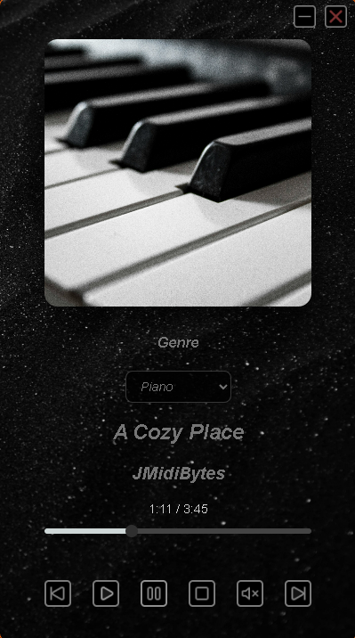
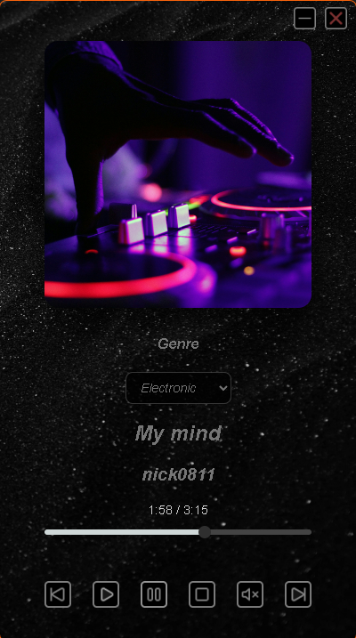
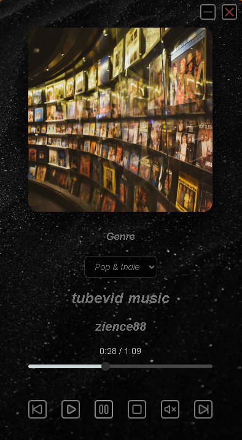

# Kumafy

A compact desktop music player built with Electron. Pick a genre, hit play, and enjoy a small library of royalty-free tracks in a minimal, frameless window.

## Screenshots





## Features

- Three genre playlists (Piano, Electronic, Pop & Indie) with a cover for each
- Play, pause, stop, mute, previous and next controls
- Seek bar with elapsed and total time
- Automatic advance to the next track
- Custom frameless window with its own minimize and close buttons

## Tech stack

- [Electron](https://www.electronjs.org/) (main process, preload script, IPC)
- HTML, CSS and vanilla JavaScript for the interface
- [electron-builder](https://www.electron.build/) to package the Windows installer

## Download

Grab the latest Windows installer from the [Releases page](https://github.com/MK-1379/kumafy/releases).

> Windows may show a SmartScreen warning because the installer is not code-signed. Click **More info**, then **Run anyway**.

## Run from source

Requires [Node.js](https://nodejs.org/) 18 or later.

```bash
git clone https://github.com/MK-1379/kumafy.git
cd kumafy
npm install
npm start
```

To build the installer:

```bash
npm run dist
```

The result is written to the `dist/` folder.

## Project structure

```
audio/         MP3 files
img/           Button icons, background, app icon and genre covers
index.html     Player interface
styles.css     Styles
tracks.js      Genres and track list
player.js      Playback logic
main.js        Electron main process
preload.js     Safe bridge between the window and the main process
```

## Adding your own tracks

1. Copy the MP3 into `audio/`.
2. Add an entry to the matching genre in `tracks.js`:

```js
{ file: "song10.mp3", title: "My Song", artist: "Me" }
```

## Roadmap

- Volume slider
- Shuffle and repeat
- Visible, clickable track list
- Keyboard shortcuts and media keys
- Remember the last track and volume
- Load local audio files
- Web demo on GitHub Pages

## License

The source code is released under the [MIT License](LICENSE). Music and images keep their own licenses, listed below.

## Audio Credits

All tracks are used under the [Pixabay Content License](https://pixabay.com/service/license-summary/). Some tracks are AI-generated or AI-assisted, as flagged by their authors on Pixabay and noted below.

**Piano**
- "A Cozy Place" by JMidiBytes (Jerrell M Battle, Afflatus Music ASCAP) - [Link](https://pixabay.com/music/modern-classical-a-cozy-place-208105/)
- "Simple Melody Simple Life" by JMidiBytes (Jerrell M Battle, Afflatus Music ASCAP) - [Link](https://pixabay.com/music/modern-classical-simple-melody-simple-life-204492/)
- "Velvet Keys-Romantic LOVE1" by VelvetKeys (AI-generated) - [Link](https://pixabay.com/music/solo-piano-velvet-keys-romantic-love1-396670/)

**Electronic**
- "My mind" by nick0811 (AI-generated) - [Link](https://pixabay.com/music/synthwave-my-mind-528306/)
- "Kinetic Peace: High-Energy Pop Techno & Brostep Fusion" by NickPanek (AI-assisted) - [Link](https://pixabay.com/music/electronic-kinetic-peace-high-energy-pop-techno-amp-brostep-fusion-516569/)
- "Abstractive" by BerryDeep - [Link](https://pixabay.com/music/electro-abstractive-600233/)

**Pop & Indie**
- "tubevid music" by zience88 (AI-generated) - [Link](https://pixabay.com/music/pop-tubevid-music-174132/)
- "Fading Colors" by Mortaz - [Link](https://pixabay.com/music/indie-pop-fading-colors-456885/)
- "good day" by NeutralProduction - [Link](https://pixabay.com/music/beats-good-day-148366/)

## Image Credits

Cover photos, the app icon and the background are from [Unsplash](https://unsplash.com) and used under the [Unsplash License](https://unsplash.com/license).

- **Piano**: Photo by [Amir Doreh](https://unsplash.com/@amirdoreh) - [Source](https://unsplash.com/photos/cHUBZFjY13g)
- **Electronic**: Photo by [Marcela Laskoski](https://unsplash.com/@marcelalaskoski) - [Source](https://unsplash.com/photos/YrtFlrLo2DQ)
- **Pop & Indie**: Photo by [Anastasiya D](https://unsplash.com/@vasilechak) - [Source](https://unsplash.com/photos/ZBdspnFLWDg)
- **App icon**: "Music Notes" by [Logan Voss](https://unsplash.com/@loganvoss) - [Source](https://unsplash.com/photos/dm84sDkLfpQ)
- **Background**: "Grey sand wave" by [Adrien Olichon](https://unsplash.com/@adrienolichon) - [Source](https://unsplash.com/photos/RCAhiGJsUUE)